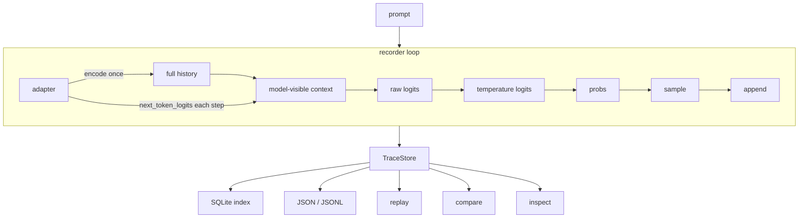
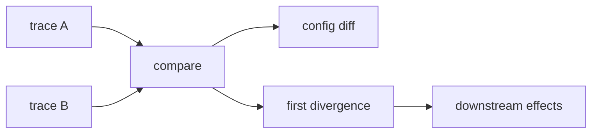

# llmfr

## What

`llmfr` records a local LLM generation step by step so you can replay it and compare two runs: where they first split, and what is only fallout after that.

## Why

Prompt and final-string logs cannot tell those apart. Two outputs can differ because the first sampled token differed, because the model-visible window was truncated, or because everything after an earlier split is downstream. A string diff treats all of that as one blob. llmfr stores per-step tokens, top-k scores when the model actually returned them, and both full history and model-visible context so compare can name the first divergence and label later diffs as not a new root cause.

## Architecture

Prompt goes to the recorder. The adapter encodes once, then supplies `next_token_logits` each step. TraceStore holds the result. Replay, compare, and inspect read stored traces. Compare does not call a model.



Compare two traces: config fields that differ, then the first causal split, then later diffs tagged as downstream of that split.



## How

Core package (schema, storage, CLI, tests with a fake adapter):

```bash
pip install -e ".[dev]"
```

`record` and live `replay` need the Hugging Face extra. Install a CPU torch wheel first so pip does not pull the CUDA-default PyPI build:

```bash
pip install --index-url https://download.pytorch.org/whl/cpu torch
pip install --upgrade-strategy only-if-needed -e ".[dev,hf]"
```

Default model is `sshleifer/tiny-gpt2`. Store directory defaults to `.llmfr`. Record twice, then compare:

```bash
A=$(llmfr record "Hello" --store .llmfr --max-new-tokens 6 --seed 1)
B=$(llmfr record "Hello" --store .llmfr --max-new-tokens 6 --seed 2)
llmfr compare "$A" "$B" --store .llmfr
```

That is Demo 1: same prompt, different `--seed`. Compare names the first split; later token, context, and logit diffs are downstream, not a second root cause. Captured `sshleifer/tiny-gpt2` report (real scores, not invented):

```
compare a=7d2b9710-9131-470d-abf8-91cb5374b155 b=51594c38-fe66-4436-8bb3-bb41e39dfaf3

CONFIG DIFFERENCE
  generation_config.seed: 1 vs 2

EXECUTION
  recorded length: 6 vs 6 steps
  same steps: (none; paths split at step 0)

FIRST BEHAVIORAL DIVERGENCE
  step 0
  class: sampling
  differences: sampled_token
  sampled token: 'ether' (id=6750) vs ' titan' (id=48047)
  reason: same context, captured logits, and decoding config; sampled tokens differ

LIKELY ENABLING CONFIG
  generation_config.seed: 1 vs 2
  seed difference likely enabled this sampling split

Steps 1+: downstream effects
  later context, logit, and token diffs are not a new root cause
  step 1 (not root cause): full_history, model_visible_context, raw_logits, probabilities, sampled_token ('IENCE' (id=42589) vs ' humankind' (id=47634))
  step 2 (not root cause): full_history, model_visible_context, raw_logits, probabilities, sampled_token ('otomy' (id=38385) vs ' Mich' (id=2843))
  step 3 (not root cause): full_history, model_visible_context, raw_logits, probabilities, sampled_token (' Naz' (id=12819) vs 'ios' (id=4267))
  step 4 (not root cause): full_history, model_visible_context, raw_logits, probabilities, sampled_token ('pex' (id=24900) vs ' ascending' (id=41988))
  step 5 (not root cause): full_history, model_visible_context, raw_logits, probabilities, sampled_token (' peas' (id=22589) vs ' Bust' (id=36988))

notes
  Later context and logit diffs are downstream of the first divergence, not a new root cause.

diverged
```

Demo 2 keeps the seed and changes temperature:

```bash
C=$(llmfr record "Hello" --store .llmfr --max-new-tokens 6 --seed 1 --temperature 0.7)
D=$(llmfr record "Hello" --store .llmfr --max-new-tokens 6 --seed 1 --temperature 1.2)
llmfr compare "$C" "$D" --store .llmfr
```

First split is `decoding config`, not a second sampling root cause:

```
CONFIG DIFFERENCE
  generation_config.temperature: 0.7 vs 1.2

EXECUTION
  recorded length: 6 vs 6 steps
  same steps: (none; paths split at step 0)

FIRST BEHAVIORAL DIVERGENCE
  step 0
  class: decoding config
  differences: sampled_token
  sampled token: 'ician' (id=6749) vs 'ether' (id=6750)
  reason: captured logits match; temperature, do_sample, or other sampler settings differ
```

Full reports (including inspect) live in `docs/demo.md`. Replay the exact reports without a model:

```bash
llmfr compare examples/demo/demo1_a.jsonl examples/demo/demo1_b.jsonl
llmfr inspect examples/demo/demo1_a.jsonl --step 0
```

`--greedy` on both records is the identical path (exit 0). `llmfr inspect TRACE --step N` shows history vs visible context plus that step's top-k. `llmfr replay TRACE_ID` needs a store id. Exit 0 means compare traces identical, or replay status `reproduced`. Exit 1 is an expected failure (including a diverged compare). Exit 2 is a usage error. `llmfr --help` lists the rest (`validate`, `topk`, `version`).

OpenAI is an optional extra, not the default. `pip install -e '.[openai]'`, set `OPENAI_API_KEY` in the environment (no `--api-key` flag), then `llmfr record "Hello" --provider openai --model gpt-4o-mini`. The adapter stores `top_logprobs` when the API returns them. That is not a full-vocab logit vector, and `llmfr replay` of an OpenAI trace is `not_replayable`. Hugging Face remains the local/CI path. See `docs/adr/0009-openai-adapter.md`.

## Essentials

- Token replay on a pinned CPU checkpoint is not a promise of bit-identical logits across GPU, dtype, or PyTorch builds. See `docs/adr/0005-deterministic-replay.md`.
- v1 is local-only: SQLite index plus JSON/JSONL files keyed by `trace_id`. Nothing is sent to a hosted store.
- Callers can redact prompt, output, sampled-token strings, top-k token strings, and context text before write (`redact_trace`, `llmfr record --redact`) or skip the store (`persist=False`, `--no-persist`). Local persist stays the default.
- If a backend does not expose real logits or logprobs, the trace records that. llmfr does not invent scores.
- v1 does not claim a compare UI, full-vocab hosted-API logits, LangChain, or a Kafka/Redis/Postgres store. OpenAI `top_logprobs` are stored when the API returns them; they are not raw logits and do not make hosted replay bit-identical. Known limits and a short roadmap: `docs/demo.md`.
- Design notes (do not duplicate here): `docs/adr/`.
