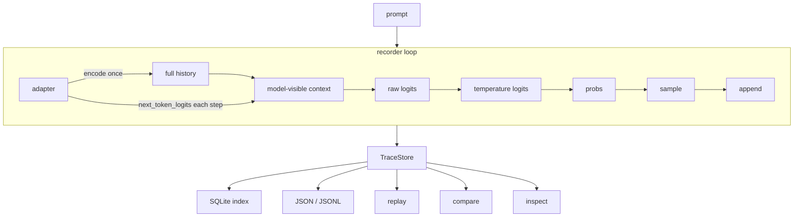
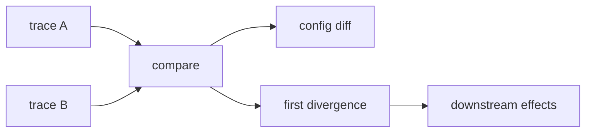
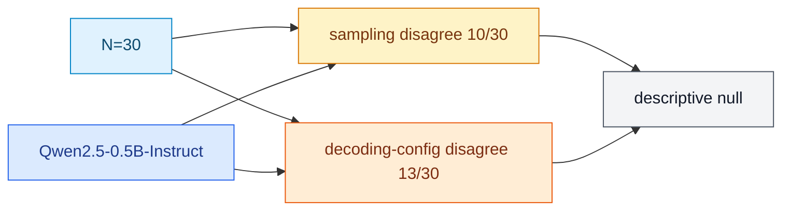

# llmfr

## What

`llmfr` records a local LLM generation step by step so you can replay it and compare two runs: where they first split, and what is only fallout after that.

## Why

Prompt and final-string logs cannot tell those apart. Two outputs can differ because the first sampled token differed, because the model-visible window was truncated, or because everything after an earlier split is downstream. A string diff treats all of that as one blob. llmfr stores per-step tokens, top-k scores when the model actually returned them, and both full history and model-visible context so compare can name the first divergence and label later diffs as not a new root cause.

## Architecture

Prompt goes to the recorder. The adapter encodes once, then supplies `next_token_logits` each step. TraceStore holds the result. Replay, compare, and inspect read stored traces. Compare does not call a model.



Compare two traces: config fields that differ, then the first causal split, then later diffs tagged as downstream of that split.



## How

Core package (schema, storage, CLI, tests with a fake adapter):

```bash
pip install -e ".[dev]"
```

`record` and live `replay` need the Hugging Face extra. Install a CPU torch wheel first so pip does not pull the CUDA-default PyPI build:

```bash
pip install --index-url https://download.pytorch.org/whl/cpu torch
pip install --upgrade-strategy only-if-needed -e ".[dev,hf]"
```

Default model is `sshleifer/tiny-gpt2` (CI/smoke). Store directory defaults to `.llmfr`. Omit `--model` to keep that smoke path. Portfolio Demo 1/2 use the ungated `Qwen/Qwen2.5-0.5B-Instruct` checkpoint at Hub commit `7ae557604adf67be50417f59c2c2f167def9a775` and a reasoning prompt (real scores, not invented). `meta-llama/Llama-3.2-1B-Instruct` was preferred for a 1B-class demo, but that Hub repo is gated and the capture environment had no `HF_TOKEN`, so Llama was not recorded:

```bash
PROMPT="A farmer has 17 sheep. All but 9 run away. How many sheep are left? Think step by step, then give the final number."
A=$(llmfr record "$PROMPT" --model Qwen/Qwen2.5-0.5B-Instruct --revision 7ae557604adf67be50417f59c2c2f167def9a775 --store .llmfr --max-new-tokens 16 --seed 1)
B=$(llmfr record "$PROMPT" --model Qwen/Qwen2.5-0.5B-Instruct --revision 7ae557604adf67be50417f59c2c2f167def9a775 --store .llmfr --max-new-tokens 16 --seed 2)
llmfr compare "$A" "$B" --store .llmfr
```

That is Demo 1: same prompt, different `--seed`. One path starts "To determine how many sheep are left"; the other starts "Step 1: Identify the initial number of sheep." Compare names the first split; later token, context, and logit diffs are downstream, not a second root cause.

```
compare a=c9276fdb-be8b-4470-9b4a-d19c3ae7e589 b=d8ee1917-67f3-4b39-8cd4-f0acc7a60cdc

CONFIG DIFFERENCE
  generation_config.seed: 1 vs 2

EXECUTION
  recorded length: 16 vs 16 steps
  same steps: (none; paths split at step 0)

FIRST BEHAVIORAL DIVERGENCE
  step 0
  class: sampling
  differences: sampled_token
  sampled token: ' To' (id=2014) vs ' Step' (id=14822)
  reason: same context, captured logits, and decoding config; sampled tokens differ

LIKELY ENABLING CONFIG
  generation_config.seed: 1 vs 2
  seed difference likely enabled this sampling split

Steps 1+: downstream effects
  later context, logit, and token diffs are not a new root cause
  step 1 (not root cause): full_history, model_visible_context, raw_logits, probabilities, sampled_token (' determine' (id=8253) vs ' ' (id=220))
  step 2 (not root cause): full_history, model_visible_context, raw_logits, probabilities, sampled_token (' how' (id=1246) vs '1' (id=16))
  step 3 (not root cause): full_history, model_visible_context, raw_logits, probabilities, sampled_token (' many' (id=1657) vs ':' (id=25))
  step 4 (not root cause): full_history, model_visible_context, raw_logits, probabilities, sampled_token (' sheep' (id=31912) vs ' Identify' (id=64547))
  step 5 (not root cause): full_history, model_visible_context, raw_logits, probabilities, sampled_token (' are' (id=525) vs ' the' (id=279))
  step 6 (not root cause): full_history, model_visible_context, raw_logits, probabilities, sampled_token (' left' (id=2115) vs ' initial' (id=2856))
  step 7 (not root cause): full_history, model_visible_context, raw_logits, probabilities, sampled_token (' after' (id=1283) vs ' number' (id=1372))
  step 8 (not root cause): full_history, model_visible_context, raw_logits, probabilities, sampled_token (' all' (id=678) vs ' of' (id=315))
  step 9 (not root cause): full_history, model_visible_context, raw_logits, probabilities, sampled_token (' but' (id=714) vs ' sheep' (id=31912))
  step 10 (not root cause): full_history, model_visible_context, raw_logits, probabilities, sampled_token (' ' (id=220) vs '.\n' (id=624))
  step 11 (not root cause): full_history, model_visible_context, raw_logits, probabilities, sampled_token ('9' (id=24) vs 'The' (id=785))
  step 12 (not root cause): full_history, model_visible_context, raw_logits, probabilities, sampled_token (' run' (id=1598) vs ' farmer' (id=36400))
  step 13 (not root cause): full_history, model_visible_context, raw_logits, probabilities, sampled_token (' away' (id=3123) vs ' starts' (id=8471))
  step 14 (not root cause): full_history, model_visible_context, raw_logits, probabilities, sampled_token (',' (id=11) vs ' with' (id=448))
  step 15 (not root cause): full_history, model_visible_context, raw_logits, probabilities, sampled_token (' we' (id=582) vs ' a' (id=264))

notes
  Later context and logit diffs are downstream of the first divergence, not a new root cause.

diverged
```

Demo 2 keeps the seed and changes temperature:

```bash
C=$(llmfr record "$PROMPT" --model Qwen/Qwen2.5-0.5B-Instruct --revision 7ae557604adf67be50417f59c2c2f167def9a775 --store .llmfr --max-new-tokens 16 --seed 1 --temperature 0.7)
D=$(llmfr record "$PROMPT" --model Qwen/Qwen2.5-0.5B-Instruct --revision 7ae557604adf67be50417f59c2c2f167def9a775 --store .llmfr --max-new-tokens 16 --seed 1 --temperature 1.2)
llmfr compare "$C" "$D" --store .llmfr
```

First eight sampled tokens still match. The first split is `decoding config` (`all but 9 run away` vs `the 9 sheep run off`), not a second sampling root cause:

```
CONFIG DIFFERENCE
  generation_config.temperature: 0.7 vs 1.2

EXECUTION
  recorded length: 16 vs 16 steps
  same steps: 0-7 (sampled tokens, model-visible context, captured logits still match)

FIRST BEHAVIORAL DIVERGENCE
  step 8
  class: decoding config
  differences: sampled_token
  sampled token: ' all' (id=678) vs ' the' (id=279)
  reason: captured logits match; temperature, do_sample, or other sampler settings differ
```

Full reports (including inspect) live in `docs/demo.md`. Replay the exact reports without a model:

```bash
llmfr compare examples/demo/demo1_a.jsonl examples/demo/demo1_b.jsonl
llmfr inspect examples/demo/demo1_a.jsonl --step 0
```

`--greedy` on both records is the identical path (exit 0). `llmfr inspect TRACE --step N` shows history vs visible context plus that step's top-k. `llmfr replay TRACE_ID` needs a store id. Exit 0 means compare traces identical, or replay status `reproduced`. Exit 1 is an expected failure (including a diverged compare). Exit 2 is a usage error. `llmfr --help` lists the rest (`validate`, `topk`, `version`).

Batch-record many prompts in one call. Each `trace_id` is printed as that item succeeds, so a later failure still leaves earlier IDs on stdout. `.jsonl` is one JSON object per line with a `prompt` field; `.txt` is one prompt per line. `--redact` and `--no-persist` apply to every item. Schema: `docs/adr/0010-batch-record.md`.

```bash
printf '%s\n' '{"prompt":"Hello"}' '{"prompt":"How many sheep are left?"}' > prompts.jsonl
llmfr record --prompts prompts.jsonl --store .llmfr --max-new-tokens 8 --greedy
```

Graded sampling vs decoding-config study. Same JSONL as `--prompts` plus required integer `gold`. The last whole number in the completion is graded against gold (no LLM judge). Hugging Face default. Schema: `docs/adr/0011-study.md`.

```bash
llmfr study examples/study/prompts.jsonl --store .llmfr --max-new-tokens 64
```

OpenAI is an optional extra, not the default. `pip install -e '.[openai]'`, set `OPENAI_API_KEY` in the environment (no `--api-key` flag), then `llmfr record "Hello" --provider openai --model gpt-4o-mini` (or `--model openai:gpt-4o-mini`). Bare `gpt-*` names stay Hugging Face unless `--provider openai` or the `openai:` prefix is set. The adapter stores `top_logprobs` when the API returns them. If the response omits per-token logprob content, recording fails closed (no tiktoken-reconstructed steps). That is not a full-vocab logit vector, and `llmfr replay` of an OpenAI trace is `not_replayable`. Hugging Face remains the local/CI path. See `docs/adr/0009-openai-adapter.md`.

## Container

The default image (`--target smoke`) runs `scripts/gs_t22s_latency.py --backend fake` via `scripts/container_latency.sh` and writes `/out/results.json` plus a labeled `/out/finding.md`. Those timings are fake-adapter smoke. They are not the Qwen p50/p99 in Findings.

```bash
docker build --target smoke -t llmfr:smoke .
mkdir -p out
docker run --rm -v "$PWD/out:/out" llmfr:smoke
```

`--target hf` adds CPU torch and the `hf` extra. The default command is `tiny-gpt2` (library CI smoke model, 1 trial). Pass `--backend hf` for the portfolio Qwen pin (downloads `Qwen/Qwen2.5-0.5B-Instruct`; slow). Container Qwen timings are that machine's capture. They do not replace the checked-in table unless you re-run `--backend hf --write-docs` on finding hardware.

```bash
docker build --target hf -t llmfr:hf .
docker run --rm -v "$PWD/out:/out" llmfr:hf
docker run --rm -v "$PWD/out:/out" llmfr:hf --backend hf --warmup 0 --trials 1
```

GitHub Actions workflow `.github/workflows/container-bench.yml` builds the smoke image on push and pull_request, runs the fake job, and uploads the JSON/MD artifacts. `workflow_dispatch` can select `tiny-gpt2` or `hf` (one trial). Artifact numbers are measured in that run. Portfolio Qwen numbers stay in [`docs/findings/gs-t22s-latency.md`](docs/findings/gs-t22s-latency.md).

## Essentials

- Token replay on a pinned CPU checkpoint is not a promise of bit-identical logits across GPU, dtype, or PyTorch builds. See `docs/adr/0005-deterministic-replay.md`.
- v1 is local-only: SQLite index plus JSON/JSONL files keyed by `trace_id`. Nothing is sent to a hosted store.
- Callers can redact prompt, output, sampled-token strings, top-k token strings, and context text before write (`redact_trace`, `llmfr record --redact`) or skip the store (`persist=False`, `--no-persist`). Those flags apply to every `--prompts` item. Local persist stays the default.
- If a backend does not expose real logits or logprobs, llmfr does not invent scores. OpenAI recording fails closed when the API omits per-token logprob content.
- v1 does not claim a compare UI, full-vocab hosted-API logits, LangChain, or a Kafka/Redis/Postgres store. OpenAI `top_logprobs` are stored when the API returns them; they are not raw logits and do not make hosted replay bit-identical. Known limits and a short roadmap: `docs/demo.md`.
- Design notes (do not duplicate here): `docs/adr/`.

## Findings

On N=30 `Qwen/Qwen2.5-0.5B-Instruct` items, sampling and decoding-config splits did not separate on this correctness-disagreement count (GS-T22n 2x descriptive label: null). First-divergence class is still a useful debug label; it did not predict wrong-answer disagreement here.

[](docs/findings/gs-t22q.md)
[](docs/findings/gs-t22q.md)
[](docs/findings/gs-t22q.md)
[](docs/findings/gs-t22q.md)
[](docs/findings/gs-t22q.md)



Full table, grading, and limits: [`docs/findings/gs-t22q.md`](docs/findings/gs-t22q.md). Raw JSON: [`docs/findings/gs-t22q-results.json`](docs/findings/gs-t22q-results.json).

CLI wall-clock on this CPU Qwen capture (warmup 2, N=11): `llmfr record` p50/p99 6.969/7.335 s, `llmfr compare` p50/p99 0.151/0.158 s, `llmfr study` (1 item, 16 tokens) p50/p99 16.854/19.715 s. Method: [`docs/findings/gs-t22s-latency.md`](docs/findings/gs-t22s-latency.md).
